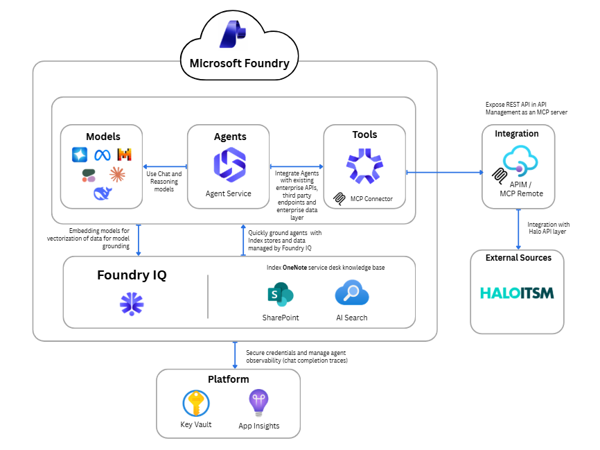

# Microsoft Foundry Service Desk Agent

**An Agentic Service Desk Powered by Microsoft Foundry, APIM MCP, and Halo ITSM**

Microsoft Foundry ITSM deploys a complete, production-oriented infrastructure on Azure that connects a Microsoft Foundry AI agent to a Halo ITSM knowledge base through API Management acting as a Model Context Protocol (MCP) server — enabling intelligent, grounded IT support responses.

> **Flow:** User → Microsoft Foundry Agent → APIM (MCP Server) → Halo ITSM API → Knowledge Base Articles

---

## 🎯 Overview

This project provisions all Azure infrastructure via Terraform and configures an AI-powered service desk assistant that retrieves knowledge base articles directly from Halo ITSM through a secured APIM gateway.

**Key capabilities:**
- Microsoft Foundry Agent (`ServiceDeskAssistant`) grounded exclusively on Halo ITSM knowledge base data
- Azure API Management exposing Halo ITSM APIs as an MCP server for Foundry tool integration
- Azure AI Search for LLM RAG patterns
- GPT-4.1 and text-embedding-ada-002 model deployments via Azure AI Services
- Managed Identity used throughout — no credentials committed to source control
- Full infrastructure-as-code via Terraform with modular structure
- Automated two-phase deployment via PowerShell orchestrator

---

## 📐 Architecture




### Core Components

| Component | Technology | Role |
|---|---|---|
| **Foundry Agent** | Microsoft Foundry, GPT-4.1 | AI service desk assistant grounded on ITSM data |
| **API Management** | Azure APIM | Exposes Halo ITSM API as an MCP server for Foundry |
| **Azure AI Search** | Azure Cognitive Search | Vector/keyword search for RAG |
| **Azure AI Services** | Azure OpenAI | GPT-4.1 inference + text-embedding-ada-002 |
| **Key Vault** | Azure Key Vault | Secrets and API key management |
| **Managed Identity** | Azure User-Assigned MI | Secretless auth across all services |
| **Storage Account** | Azure Blob Storage | Data and artifact storage |
| **Container Registry** | Azure ACR | Docker image registry |
| **Application Insights** | Azure Monitor | Observability and telemetry |

---

## 📁 Project Structure

<details>
<summary>Expand to view repository layout</summary>

```
Azure-AI-Foundry-ITSM/
├── deploy.ps1                          # Full end-to-end deployment orchestrator
├── README.md                           # This file
│
├── docs/
│   ├── Deployment_Steps.md             # Step-by-step deployment and configuration guide
│   ├── workshop.md                     # 4-hour workshop agenda and guide
│   └── prompt_examples.md             # Sample prompts for testing the agent
│
├── infra/                              # Infrastructure as Code (Terraform)
│   ├── main.tf                         # Root module — wires all child modules
│   ├── variables.tf                    # Variable declarations
│   ├── outputs.tf                      # Output definitions
│   ├── provider.tf                     # Azure provider configuration
│   ├── locals.tf                       # Local computed values
│   ├── terraform.tfvars.tpl            # Variable template (auto-populated by deploy.ps1)
│   └── modules/
│       ├── ai_services/                # Azure AI Services (OpenAI, Hub, Project)
│       ├── apim/                       # API Management + Halo ITSM API
│       ├── container_registry/         # Azure Container Registry
│       ├── identity/                   # User-assigned Managed Identity + RBAC
│       ├── key_vault/                  # Key Vault
│       ├── monitoring/                 # Log Analytics + Application Insights
│       ├── resource_group/             # Resource Group
│       ├── search/                     # Azure AI Search
│       └── storage/                    # Storage Account
│
├── Notebooks/
│   ├── 01_azure_ai_agent-mcp.ipynb    # Foundry agent + MCP demo notebook
│   ├── .env.sample                    # Environment variable template for notebook
│   └── requirements.txt               # Python dependencies
│
└── scripts/
    ├── Deploy-Infrastructure.ps1       # Phase 1: Terraform infrastructure deployment
    ├── Deploy-APIM-Configuration.ps1  # Phase 2: APIM secrets deployment
    └── common/
        └── DeploymentFunctions.psm1   # Shared PowerShell utilities
```

</details>

---

## 🚀 Deployment

### Prerequisites

| Tool | Version | Notes |
|---|---|---|
| Terraform | >= 1.5 | **Windows:** `winget install HashiCorp.Terraform` · **macOS:** `brew install hashicorp/tap/terraform` · **Linux:** [Install guide](https://developer.hashicorp.com/terraform/install) |
| Azure CLI | Latest | [Install](https://learn.microsoft.com/en-us/cli/azure/install-azure-cli) · `az login` authenticated |
| PowerShell | 7+ | **Windows:** Built-in or `winget install Microsoft.PowerShell` · **Linux/macOS:** [Install guide](https://learn.microsoft.com/en-us/powershell/scripting/install/installing-powershell) |
| Python | 3.10+ | Required for the notebook demo |
| Azure subscription | — | Sufficient quota for OpenAI, APIM, AI Search. **Owner or Contributor + User Access Administrator** role required. |
| Halo ITSM API Key | — | Register an application in Halo (**Configuration → Integrations → Halo API → Authorise a new application**, auth method: `API Key`). See [Deployment_Steps.md](docs/deployment_Steps.md#halo-itsm) for full steps. |

### 1. Clone the Repository

```bash
git clone https://github.com/jonathanscholtes/Azure-AI-Foundry-ITSM.git
cd Azure-AI-Foundry-ITSM
```

### 2. Deploy Everything (Single Command)

To find your subscription ID:
```powershell
az account list --output table
```

**Windows (PowerShell 7+):**
```powershell
az login
az account set --subscription "YOUR-SUBSCRIPTION-ID"

.\deploy.ps1 `
    -Subscription "YOUR-SUBSCRIPTION-ID" `
    -Location "eastus2" `
    -Environment "dev" `
    -HaloApiKey "YOUR-HALO-API-KEY" `
    -HaloBaseUrl "https://YOURINSTANCE.haloitsm.com/api"
```

**Linux / macOS (PowerShell 7+):**
```powershell
az login
az account set --subscription "YOUR-SUBSCRIPTION-ID"

pwsh ./deploy.ps1 `
    -Subscription "YOUR-SUBSCRIPTION-ID" `
    -Location "eastus2" `
    -Environment "dev" `
    -HaloApiKey "YOUR-HALO-API-KEY" `
    -HaloBaseUrl "https://YOURINSTANCE.haloitsm.com/api"
```

> **Estimated time:** 15–40 minutes. API Management provisioning is the slowest resource.

**The deployment runs two phases automatically:**

| Phase | Script | What it does |
|---|---|---|
| 1 — Infrastructure | `Deploy-Infrastructure.ps1` | Provisions all Azure resources via Terraform |
| 2 — APIM Configuration | `Deploy-APIM-Configuration.ps1` | Stores Halo API key in Key Vault |

**Resources created (~15–40 min):**

- Resource Group
- Azure AI Services (GPT-4.1 + text-embedding-ada-002 deployments)
- Azure AI Search
- API Management (with Halo ITSM MCP server)
- Storage Account
- Azure Container Registry
- Azure Key Vault
- User-Assigned Managed Identity + RBAC assignments
- Application Insights + Log Analytics Workspace

---

## 🔧 Configuration

<details>
<summary>Expand to view variable reference</summary>

### Infrastructure Variables (`terraform.tfvars`)

| Variable | Default | Description |
|---|---|---|
| `subscription_id` | — | Azure subscription ID (required) |
| `resource_group_name` | `rg-ai-foundry-itsm` | Resource group name |
| `location` | `eastus2` | Azure region |
| `environment` | `dev` | Environment designation (dev, staging, prod) |
| `project_name` | `aifoundry` | Project identifier used in resource naming |
| `managed_identity_name` | `id-ai-foundry-main` | User-assigned managed identity name |
| `search_service_name` | `aisearch-foundry` | Azure AI Search service name |
| `ai_services_deployment_gpt41_capacity` | `150` | GPT-4.1 deployment capacity (PTUs) |
| `ai_services_deployment_embedding_capacity` | `120` | text-embedding-ada-002 capacity (PTUs) |
| `halo_base_url` | — | Base URL of your Halo ITSM API (e.g., `https://yourinstance.haloitsm.com/api`) |

### Key Outputs

After deployment, retrieve resource endpoints with:

```powershell
cd infra
terraform output
```

| Output | Description |
|---|---|
| `apim_gateway_url` | APIM gateway URL (base URL for MCP server) |
| `apim_portal_url` | APIM developer portal URL |
| `search_service_endpoint` | Azure AI Search endpoint |
| `ai_account_endpoint` | Azure AI Services endpoint |
| `openai_endpoint` | OpenAI-compatible endpoint |
| `key_vault_uri` | Key Vault URI |
| `container_registry_login_server` | ACR login server |

</details>

---

## 🔌 Post-Deployment: Configure APIM & Foundry

After `deploy.ps1` completes, four manual steps are required in the Azure Portal and Microsoft Foundry portal. Full instructions with exact field values are in **[Deployment_Steps.md](docs/deployment_Steps.md)**.

| Step | Where | What |
|---|---|---|
| **1. Create MCP Server** | Azure Portal → APIM → MCP Servers | Wrap the Halo ITSM API as an MCP server and copy the endpoint URL |
| **2. Register MCP Tool** | [ai.azure.com](https://ai.azure.com/) → Build → Tools | Connect the APIM MCP endpoint as a custom tool named `Halo-ITSM-MCP` |
| **3. Create Agent** | [ai.azure.com](https://ai.azure.com/) → Build → Agents | Create `ServiceDeskAssistant` with GPT-4.1, attach `Halo-ITSM-MCP`, add system prompt |
| **4. Notebook (optional)** | `Notebooks/.env` + `.ipynb` | Copy `.env.sample` → `.env`, fill in values from `terraform output`, run cells |

> 📋 **[View the complete step-by-step guide → Deployment_Steps.md](docs/deployment_Steps.md)**

---

## ♻️ Clean Up

After completing testing or when no longer needed, destroy all Azure resources to avoid additional charges:

**Windows:**
```powershell
.\deploy.ps1 -Subscription "YOUR-SUBSCRIPTION-ID" -Destroy
```

**Linux / macOS:**
```powershell
pwsh ./deploy.ps1 -Subscription "YOUR-SUBSCRIPTION-ID" -Destroy
```

Or manually:
```powershell
cd infra
terraform destroy
```

---

## 📜 License

This project is licensed under the [MIT License](LICENSE).

---

## ⚠️ Disclaimer

**THIS CODE IS PROVIDED FOR EDUCATIONAL AND DEMONSTRATION PURPOSES ONLY.**

This sample code is not intended for production use and is provided "AS IS", without warranty of any kind, express or implied, including but not limited to the warranties of merchantability, fitness for a particular purpose, and noninfringement. In no event shall the authors or copyright holders be liable for any claim, damages, or other liability, whether in an action of contract, tort, or otherwise, arising from, out of, or in connection with the software or the use or other dealings in the software.

**Key Points:**
- This is a **demonstration project** showcasing agentic ITSM patterns with Microsoft Foundry and APIM MCP
- **Not intended for production** without significant additional development, testing, and compliance review
- Users are responsible for ensuring compliance with applicable regulations and security requirements
- Microsoft Azure services incur costs — monitor your usage and clean up resources when done
- No warranties or guarantees are provided regarding accuracy, reliability, or suitability for any purpose

By using this code, you acknowledge that you understand these limitations and accept full responsibility for any consequences of its use.
