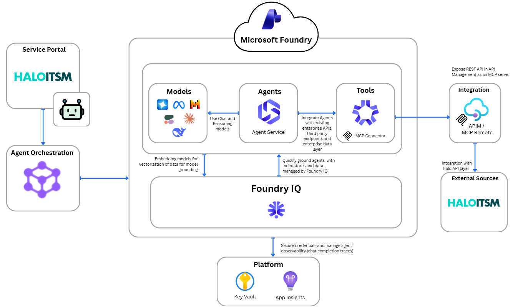

# Agentic Service Desk — Microsoft Foundry + MCP Reference Architecture

A production-style reference implementation showing how to build **multi-agent IT service desk automation** using Microsoft Foundry, the Agent Framework SDK, Model Context Protocol (MCP), and Azure API Management.

The patterns demonstrated here — classifier-based routing, fan-out to parallel agents, MCP tool integration through a secure gateway — are **reusable building blocks** applicable to any domain where AI agents need governed access to enterprise systems.

---

## Architecture



### Workflow

```
React UI → FastAPI (Container App) → Agent Framework Workflow
                                        ├─ Classifier Agent (Foundry)
                                        ├─ KB Lookup Agent (Foundry + MCP)
                                        ├─ Ticket Agent (Foundry + MCP)
                                        └─ Triage Agent (Foundry + MCP)
                                              │
                                        APIM (MCP Gateway) → Halo ITSM API
```

### Azure Resources

| Component | Service | Role |
|---|---|---|
| Agent orchestration | Microsoft Foundry (GPT-4.1 / GPT-4.1-mini) | Hosts all agents with server-side instructions; classifier uses GPT-4.1-mini for lower latency |
| Workflow engine | Agent Framework SDK | Switch-case routing, fan-out, streaming |
| API backend | Azure Container Apps (FastAPI) | Workflow gateway, NDJSON streaming |
| Frontend | Azure Container Apps (React/Vite) | Service desk UI |
| Tool gateway | Azure API Management | Exposes Halo ITSM as MCP tools with policies |
| Agent name store | Azure App Configuration | Runtime agent name resolution |
| Container images | Azure Container Registry | Docker images for API + UI |
| Auth | User-Assigned Managed Identity | Secretless auth across all services |
| Secrets | Azure Key Vault | Halo ITSM credentials for APIM policies |
| LLM inference | Azure AI Services | GPT-4.1 + text-embedding-ada-002 |
| Search | Azure AI Search | Vector/keyword search (RAG-ready) |
| Observability | Application Insights | Telemetry and logging |

---

## Getting Started

### Prerequisites

| Tool | Version | Install |
|---|---|---|
| Terraform | >= 1.5 | `winget install HashiCorp.Terraform` / `brew install hashicorp/tap/terraform` |
| Azure CLI | Latest | [Install guide](https://learn.microsoft.com/en-us/cli/azure/install-azure-cli) |
| PowerShell | 5.1+ (Windows) / 7+ (Linux/macOS) | Built-in or `winget install Microsoft.PowerShell` |
| Docker | Latest | Required for container builds |
| Python | 3.11+ | Required for agent provisioning and notebook |
| Azure subscription | — | Owner or Contributor + User Access Administrator |
| Halo ITSM | — | API Key or OAuth Client Credentials |

### Clone the Repository

```bash
git clone https://github.com/jonathanscholtes/Azure-AI-Foundry-ITSM.git
cd Azure-AI-Foundry-ITSM
```

### Deploy Everything (Single Command)

```powershell
az login
az account set --subscription "YOUR-SUBSCRIPTION-ID"

# Option A: API Key authentication
.\deploy.ps1 `
    -Subscription "YOUR-SUBSCRIPTION-ID" `
    -Location "eastus2" `
    -HaloApiKey "YOUR-HALO-API-KEY" `
    -HaloBaseUrl "https://YOURINSTANCE.haloitsm.com/api"

# Option B: OAuth Client Credentials
.\deploy.ps1 `
    -Subscription "YOUR-SUBSCRIPTION-ID" `
    -Location "eastus2" `
    -HaloAuthMethod "oauth" `
    -HaloClientId "YOUR-CLIENT-ID" `
    -HaloClientSecret "YOUR-CLIENT-SECRET" `
    -HaloAuthUrl "https://YOURINSTANCE.haloitsm.com/auth/token" `
    -HaloBaseUrl "https://YOURINSTANCE.haloitsm.com/api"
```

> On Linux / macOS, prefix with `pwsh` (e.g., `pwsh ./deploy.ps1 ...`).

The orchestrator runs four phases automatically:

| Phase | Script | What It Does |
|---|---|---|
| 1 | `Deploy-Infrastructure.ps1` | Provisions all Azure resources via Terraform |
| 1.5 | `Deploy-Containers.ps1` | Builds Docker images, pushes to ACR, updates Container Apps |
| 2 | `Deploy-APIM-Configuration.ps1` | Stores Halo credentials in Key Vault for APIM policies |
| 3 | `Deploy-FoundryAgents.ps1` | Creates/versions agents in Foundry, writes names to App Config |
| 4 | `New-GitHubOidc.ps1` | (Optional, `-SetupGitHub`) Configures GitHub Actions OIDC |

> Full step-by-step instructions: **[docs/deployment_Steps.md](docs/deployment_Steps.md)**
>
> Portal-based deployment: **[docs/manual_deployment.md](docs/manual_deployment.md)**

---

## Post-Deployment: Configure APIM MCP Server

After `deploy.ps1` completes, the APIM MCP server must be configured in the Azure Portal to expose the Halo ITSM API as agent-callable tools. Full instructions with exact field values are in **[docs/deployment_Steps.md](docs/deployment_Steps.md)**.

| Step | Where | What |
|---|---|---|
| **1. Create MCP Server** | Azure Portal → APIM → MCP Servers | Wrap the Halo ITSM API as an MCP server and copy the endpoint URL |
| **2. Verify Tool Registration** | [ai.azure.com](https://ai.azure.com/) → Foundry Project → Agents | Confirm MCP tools appear on the deployed agents |

> The deployment script (`Deploy-FoundryAgents.ps1`) automatically registers the MCP server URL and APIM subscription key on each agent that uses tools. This step verifies the configuration is correct.

---

## Patterns You Can Reuse

### 1. Classifier → Specialist Agent Routing

A lightweight classifier agent receives every user message and returns a structured JSON intent. The Agent Framework SDK's **switch-case workflow** routes the request to the appropriate specialist agent — no application code touches the LLM response directly.

```
User message → Classifier → switch(intent)
                              ├─ kb_lookup    → KB Lookup Agent → response
                              ├─ ticket       → Ticket Agent    → response
                              ├─ kb_and_ticket→ Fan-out (both)  → merged response
                              ├─ triage       → Triage Agent    → response
                              └─ default      → General handler
```

**Why this matters:** Adding a new specialist is a three-step process — define the agent, add a case to the classifier prompt, wire a new edge in the workflow builder. No routing logic to maintain.

### 2. Fan-Out to Multiple Agents

When a user query is ambiguous ("Issues with Teams performance"), the `kb_and_ticket` intent calls **both** the KB lookup and ticket agents concurrently, merges results, and filters out empty responses. This pattern extends to any scenario where multiple data sources should be checked in parallel.

### 3. MCP + APIM as a Secure Enterprise Tool Gateway

Enterprise APIs (Halo ITSM in this case) are exposed to agents as **MCP tools** through Azure API Management. APIM handles authentication, rate limiting, and policy enforcement — agents never hold backend credentials directly. The MCP server is a standard protocol interface, so swapping the backend system requires only an APIM configuration change.

### 4. Streaming Agent Responses via HTTP

The FastAPI backend streams workflow events to the React UI using **NDJSON (Newline-Delimited JSON) over HTTP**. This provides real-time feedback as agents process requests, without polling.

### 5. Infrastructure-as-Code for the Full Agent Stack

A single `deploy.ps1` orchestrates: Terraform infrastructure → container builds → Foundry agent provisioning → App Configuration writes. All agent names are resolved at runtime from **Azure App Configuration**, so the API service has zero hardcoded agent references.

---

## Configuration

<details>
<summary>Infrastructure Variables (terraform.tfvars)</summary>

| Variable | Default | Description |
|---|---|---|
| `subscription_id` | — | Azure subscription ID (required) |
| `resource_group_name` | `rg-ai-foundry-itsm` | Resource group name |
| `location` | `eastus2` | Azure region |
| `environment` | `dev` | Environment designation (dev, staging, prod) |
| `project_name` | `aifoundry` | Project identifier used in resource naming |
| `managed_identity_name` | `id-ai-foundry-main` | User-assigned managed identity name |
| `search_service_name` | `aisearch-foundry` | Azure AI Search service name |
| `ai_services_deployment_gpt41_capacity` | `150` | GPT-4.1 deployment capacity (PTUs) |
| `ai_services_deployment_gpt41_mini_capacity` | `150` | GPT-4.1-mini deployment capacity (PTUs, used by classifier) |
| `ai_services_deployment_embedding_capacity` | `120` | text-embedding-ada-002 capacity (PTUs) |
| `halo_base_url` | — | Base URL of your Halo ITSM API (e.g., `https://yourinstance.haloitsm.com/api`) |
| `halo_auth_method` | `apikey` | Authentication method: `apikey` or `oauth` |
| `halo_auth_url` | — | OAuth token endpoint (required when `halo_auth_method` = `oauth`) |

</details>

<details>
<summary>Key Terraform Outputs</summary>

After deployment, retrieve resource endpoints with:

```powershell
cd infra
terraform output
```

| Output | Description |
|---|---|
| `apim_gateway_url` | APIM gateway URL (base URL for MCP server) |
| `ai_project_endpoint` | Foundry project endpoint |
| `container_registry_login_server` | ACR login server |
| `app_configuration_endpoint` | App Configuration endpoint |
| `resource_group_name` | Resource group name |
| `container_app_url` | API container app URL |
| `container_app_ui_url` | UI container app URL |

</details>

---

## Project Structure

<details>
<summary>Expand to view repository layout</summary>

```
Azure-AI-Foundry-ITSM/
├── deploy.ps1                              # Single-command deployment orchestrator
├── agents/                                 # Foundry agent definitions (instructions + config)
│   ├── classifier.py                       #   Intent classifier (5 intents, JSON output)
│   ├── kb_lookup.py                        #   Knowledge base article retrieval (MCP)
│   ├── ticket_agent.py                     #   Ticket CRUD operations (MCP)
│   ├── triage_agent.py                     #   Issue classification & team routing (MCP)
│   └── deploy.py                           #   Agent provisioning script (Foundry API)
├── apps/
│   ├── services/itsm-api/                  # FastAPI backend
│   │   ├── src/
│   │   │   ├── main.py                     #   NDJSON streaming endpoint
│   │   │   ├── config.py                   #   Settings from env/App Configuration
│   │   │   └── workflow/
│   │   │       ├── pipeline.py             #   Workflow builder (switch-case graph)
│   │   │       ├── handlers.py             #   Executors (routing, fan-out, finalize)
│   │   │       ├── classifier.py           #   Classifier agent factory
│   │   │       └── models.py              #   ClassificationResult (Pydantic)
│   │   ├── Dockerfile
│   │   └── pyproject.toml
│   └── ui/                                 # React frontend (Vite)
│       ├── src/
│       │   ├── components/ChatPanel.jsx    #   Chat interface with HTML rendering
│       │   └── App.jsx
│       ├── Dockerfile
│       └── package.json
├── infra/                                  # Terraform modules
│   ├── main.tf                             #   Root module wiring all children
│   └── modules/
│       ├── ai_services/                    #   Foundry hub, project, model deployments
│       ├── apim/                           #   APIM + Halo ITSM API + MCP server
│       ├── container_registry/             #   ACR
│       ├── identity/                       #   Managed Identity + RBAC
│       ├── key_vault/                      #   Key Vault
│       ├── monitoring/                     #   Log Analytics + App Insights
│       ├── resource_group/                 #   Resource Group
│       ├── search/                         #   Azure AI Search
│       └── storage/                        #   Storage Account
├── scripts/
│   ├── Deploy-Infrastructure.ps1           # Phase 1: Terraform
│   ├── Deploy-APIM-Configuration.ps1       # Phase 2: APIM secrets
│   ├── Deploy-Containers.ps1               # Phase 1.5: Docker build + ACR push
│   ├── Deploy-FoundryAgents.ps1            # Phase 3: Agent provisioning
│   ├── New-GitHubOidc.ps1                  # Phase 4: GitHub Actions OIDC setup
│   └── common/DeploymentFunctions.psm1     # Shared utilities
├── Notebooks/
│   └── 01_azure_ai_agent-mcp.ipynb         # Interactive Foundry + MCP demo
└── docs/
    ├── deployment_Steps.md                 # Detailed deployment walkthrough
    ├── manual_deployment.md                # Portal-based deployment guide
    └── prompt_examples.md                  # Sample test prompts
```

</details>

---

## Adapting to Your Domain

This implementation uses Halo ITSM as the example backend, but the patterns are backend-agnostic:

1. **Swap the backend system** — Replace the Halo ITSM API definition in the APIM module with your own API (ServiceNow, Jira, Zendesk, or any REST API). The MCP server wraps it automatically.

2. **Add a new specialist agent** — Define instructions in `agents/`, add an intent to the classifier prompt, wire a new `Case` in `pipeline.py`. The workflow builder handles the rest.

3. **Change the fan-out strategy** — The `to_kb_and_ticket` handler pattern works for any scenario where you want to query multiple agents and merge results (e.g., check inventory + order status simultaneously).

4. **Use a different LLM** — Change the `ModelDeployment` parameter in `deploy.ps1`. The agent instructions are model-agnostic.

---

## Clean Up

Destroy all Azure resources to avoid additional charges:

```powershell
# Windows
.\deploy.ps1 -Subscription "YOUR-SUBSCRIPTION-ID" -Destroy

# Linux / macOS
pwsh ./deploy.ps1 -Subscription "YOUR-SUBSCRIPTION-ID" -Destroy
```

Or manually:
```powershell
cd infra
terraform destroy
```

---

## License

This project is licensed under the [MIT License](LICENSE).

---

## Disclaimer

**This code is provided for educational and demonstration purposes only.**

This sample is not intended for production use without additional development, testing, and compliance review. It is provided "AS IS" without warranty of any kind. Users are responsible for ensuring compliance with applicable regulations and security requirements. Azure services incur costs, monitor usage and clean up resources when done.
